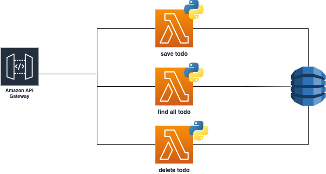

# todo-service

It is a serverless todo service designed to provide a todo list service to onlyone-portal

# Architecture



# local development

The product is build with [AWS SAM](https://docs.aws.amazon.com/serverless-application-model/latest/developerguide/what-is-sam.html) 
therefore can be used the classic commands like below (pay attention! python 3.8 should be installed):

```shell

sam build

sam local start-api
```

During the test could be that some errors can happen for dynamodb ... be patient those issue will be fixed with the product development

